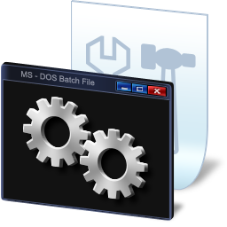
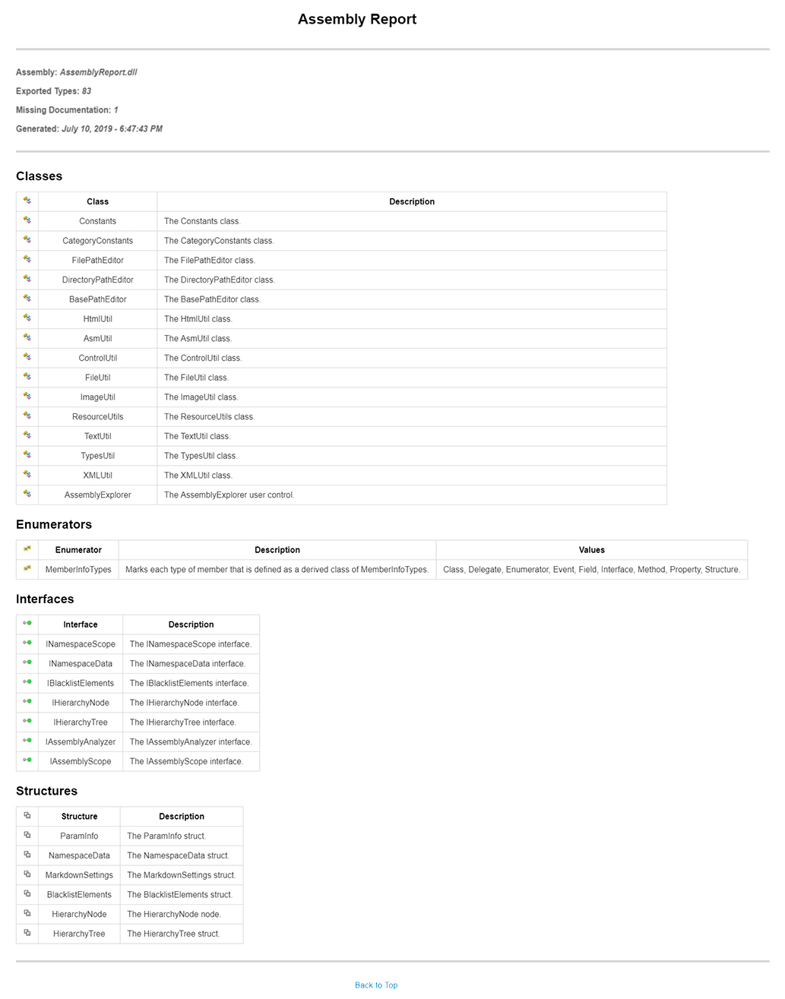
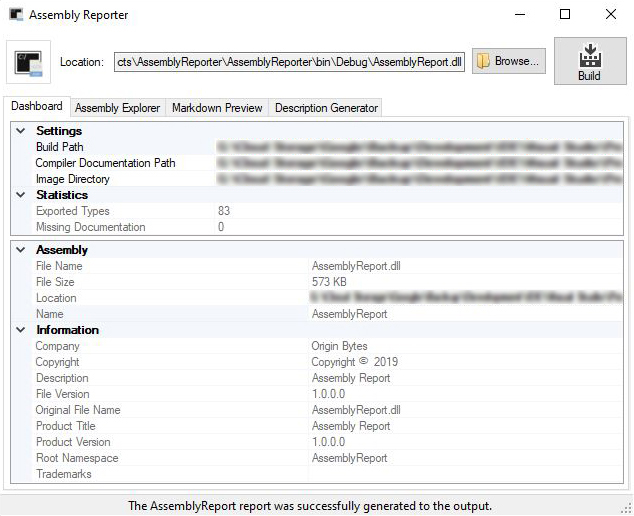
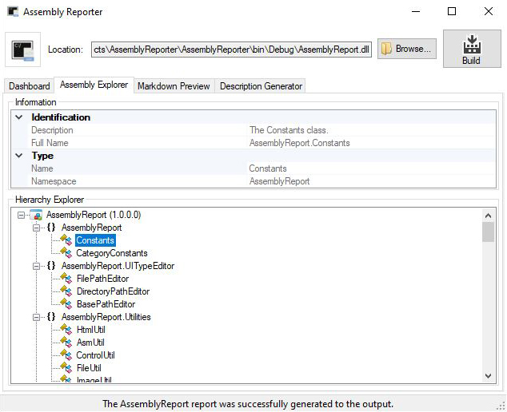

[comment]: # "Initializes the document variables."

[comment]: # "The assembly links"
[Repo.AssemblyReporter]: https://github.com/CelestialChaos/AssemblyReporter/tree/master/AssemblyReporter "Assembly: AssemblyReporter"

[Repo.AssemblyReport]: https://github.com/CelestialChaos/AssemblyReporter/tree/master/AssemblyReport "Assembly: AssemblyReport"

[comment]: # "The NuGet package links."
[NuGet.AssemblyReport]: https://www.nuget.org/packages/AssemblyReport/ "NuGet Link: AssemblyReport"

[comment]: # "The NuGet downloads count."
[NuGet.Downloads.AssemblyReport]: https://img.shields.io/nuget/dt/AssemblyReport.svg?label=Count: "NuGet Downloads Count: AssemblyReport"

[comment]: # "The NuGet assembly badge links."
[NuGet.AssemblyReport.Badge]: https://img.shields.io/nuget/v/AssemblyReport.svg?style=flat&label=Link "NuGet Download: AssemblyReport"

[comment]: # "The NuGet packages links."
[NuGet.Download.AssemblyReport]: https://www.nuget.org/packages/AssemblyReport/ "NuGet Link: AssemblyReport"

[comment]: # "The GitHub variables"
[GitHub.Downloads]: https://github.com/CelestialChaos/AssemblyReporter/releases
[GitHub.Downloads.Image]: https://img.shields.io/github/downloads/CelestialChaos/AssemblyReporter/total.svg?style=flat&label=Downloads%20&#40;GitHub&#41; "Downloads (GitHub)"

<h1 align="center">Assembly Reporter</h1>

[GitHub.License.File]: https://github.com/CelestialChaos/AssemblyReporter/blob/master/LICENSE.md "License: GPL-3.0"
[GitHub.License.Image]: https://img.shields.io/badge/GPL-3.0-blue.svg?style=flat&label=License:%20GPL "License: GPL-3.0"

[GitHub.Repo.Stars]: https://github.com/CelestialChaos/AssemblyReporter/stargazers "Stargazers"
[GitHub.Repo.Stars.Image]: https://img.shields.io/github/stars/CelestialChaos/AssemblyReporter.svg?style=flat&label=Stargazers "Stargazers"

[GitHub.Repo.Forks]: https://github.com/CelestialChaos/AssemblyReporter/network/members "Forks"
[GitHub.Repo.Forks.Image]: https://img.shields.io/github/forks/CelestialChaos/AssemblyReporter.svg?style=flat&label=Forks "Forks"

[GitHub.Repo.Issues]: https://github.com/CelestialChaos/AssemblyReporter/issues/ "Issues"
[GitHub.Repo.Issues.Image]: https://img.shields.io/github/issues/CelestialChaos/AssemblyReporter.svg?style=flat&label=Issues "Issues"

[GitHub.Repo.Watchers]: https://github.com/CelestialChaos/AssemblyReporter/watchers/ "Watchers"
[GitHub.Repo.Watchers.Image]: https://img.shields.io/github/watchers/CelestialChaos/AssemblyReporter.svg?style=flat&label=Watchers "Watchers"

[GitHub.Repo.Commits]: https://github.com/CelestialChaos/AssemblyReporter/commits/master
[GitHub.Repo.Commits.Image]: https://img.shields.io/github/last-commit/CelestialChaos/AssemblyReporter.svg?label=Latest%20Commit "Latest Commits"

### Statistics

| Value
| :---:
|  |
| [![GitHub Downloads][GitHub.Downloads.Image]][GitHub.Downloads] |
| [![Latest Commit][GitHub.Repo.Commits.Image]][GitHub.Repo.Commits] |
| [![GitHub License Image][GitHub.License.Image]][GitHub.License.File] |
| [![GitHub Stargazers][GitHub.Repo.Stars.Image]][GitHub.Repo.Stars] |
| [![GitHub Forks][GitHub.Repo.Forks.Image]][GitHub.Repo.Forks] |
| [![GitHub Downloads][GitHub.Repo.Issues.Image]][GitHub.Repo.Issues] |
| [![GitHub Watchers][GitHub.Repo.Watchers.Image]][GitHub.Repo.Watchers] |
|  |

---

The Assembly Reporter generates assembly API documentation reports with ease.

---

## ⭐ Features ⭐
- Supports .NET runtime environment.
- Export the assembly report as markdown (`*.md`) file.
- Link to the compiler documentation (`*.xml`) for additional documentation.
- A member type description generator to assist in resolving missing documentation.

## Build Status
[comment]: # "The repository branch builds status."
[GitHub.Build.Development]: https://ci.appveyor.com/project/CelestialChaos/AssemblyReporter/branch/development "Build Status - Branch: Development"
[GitHub.Build.Development.Image]: https://img.shields.io/appveyor/ci/CelestialChaos/AssemblyReporter/development.svg?style=flat&label=Branch%20Build "Build Status - Branch: Development"
[GitHub.Build.Master]: https://ci.appveyor.com/project/CelestialChaos/AssemblyReporter/branch/master "Build Status - Branch: Master"
[GitHub.Build.Master.Image]: https://img.shields.io/appveyor/ci/CelestialChaos/AssemblyReporter/master.svg?style=flat&label=Branch%20Build "Build Status - Branch: Master"

| Branch | Status
| :---: | :---:
| Development | [ ![Development Branch Status][GitHub.Build.Development.Image]][GitHub.Build.Development] |
| Master | [ ![Master Branch Status][GitHub.Build.Master.Image]][GitHub.Build.Master] |

To get the latest release, you can download a [`Fresh Build`](https://ci.appveyor.com/project/CelestialChaos/AssemblyReporter/build/artifacts) here. 

The [`AssemblyReporter`](https://github.com/CelestialChaos/AssemblyReporter) repository is where we do development and there are many ways you can participate in the project, for example:
- [Submit bugs and feature requests](https://github.com/CelestialChaos/AssemblyReporter/issues) and help us verify as they are checked in.
- Review [source code changes](https://github.com/CelestialChaos/AssemblyReporter/pulls).
- Review the [documentation](https://github.com/CelestialChaos/AssemblyReporter/wiki) and make pull requests for anything from typos to new content.

## Build requirements
- [Microsoft .NET](https://dotnet.microsoft.com/download "Download: Microsoft .NET")
- [Microsoft Visual Studio](https://visualstudio.microsoft.com/downloads/  "Download: Microsoft Visual Studio")

## Contributing
If you are interested in fixing issues and contributing directly to the code base, please see the document [How to Contribute](https://github.com/CelestialChaos/AssemblyReporter/wiki/How-to-Contribute), which covers the following:
- [How to build and run from source](https://github.com/CelestialChaos/AssemblyReporter/wiki/How-to-Contribute#build-and-run-from-source)
- [Coding Guidelines](https://github.com/CelestialChaos/AssemblyReporter/wiki/Coding-Guidelines)
- [Submitting pull requests](https://github.com/CelestialChaos/AssemblyReporter/compare)

## Framework Architecture
| Assembly | Description | Downloads | NuGet | Progress | Version |
| :---: | :---: | :---: | :---: | :---: | :---:
| [AssemblyReport][Repo.AssemblyReport] | Assembly Report API |  | [![NuGet Download: AssemblyReport][NuGet.AssemblyReport.Badge]][NuGet.Download.AssemblyReport] |  |  |

## Platform Support
###### Dependency's references depend on which assemblies are referenced for use.
| Name | Version | Website
| :---: | :---: | :---: |
| .NET Framework | 4.0 | [Download](https://dotnet.microsoft.com/download/dotnet-framework  "Download: .NET Framework") |

## API Sample Code
There is a variety of examples that can be found in the [UnitTests](https://github.com/CelestialChaos/AssemblyReporter/tree/master/UnitTests) folder.

## Screenshots
###### Report Example

###### UI

## Feedback
- Ask a question on [Discord](https://discordapp.com/invite/4MHvGwp).
- Request a new feature on [GitHub](https://github.com/CelestialChaos/AssemblyReporter/blob/master/CONTRIBUTE.md).
- Vote for [popular feature requests](https://github.com/CelestialChaos/AssemblyReporter/issues?q=is:open+is:issue+label:feature-request+sort:reactions-B1-desc).
- File a bug in [GitHub Issues](https://github.com/CelestialChaos/AssemblyReporter/issues?q=is:open+is:issue).

Enjoy using `Assembly Reporter` or just want to say thanks?
Hit the ⭐️ Star ⭐️ button.
